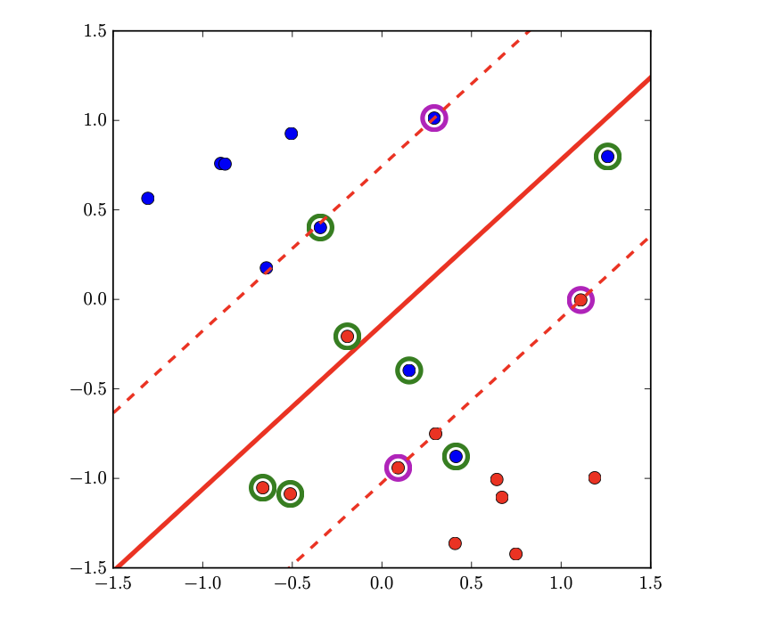
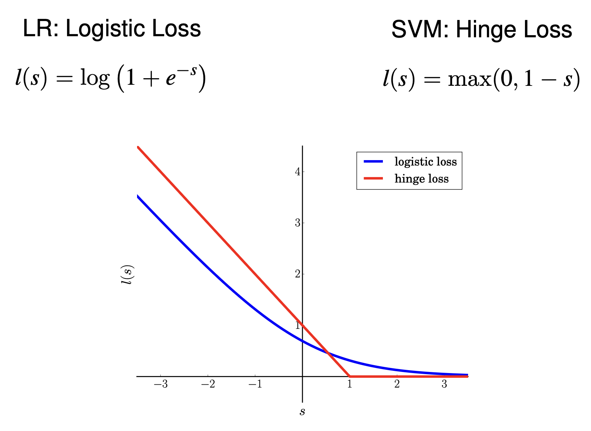

### **Support Vector Machines (SVM)**

SVMs are an alternative to Logistic Regression (LR). While LR minimizes the logistic loss with regularization, SVMs
solve a generalized risk minimization problem. They achieve non linear separation using the Kernel Trick, avoiding
explicit feature expansion. SVM scores are not probabilistic.

#### **1. Classification rule and score interpretation**

* The SVM decision function is

  $$
  f(x) = w^T x + b.
  $$
* The **classification rule**:

  $$
  f(x_i) > 0 \;\;\text{if } c_i = \mathcal{H}_T \\
  f(x_i) < 0 \;\;\text{if } c_i = \mathcal{H}_F
  $$

i.e., assign class +1 if $f(x) > 0$, −1 otherwise.

* The **SVM score** $f(x)$ is the signed distance of sample x from the separating hyperplane, scaled by $\|w\|$. The
  magnitude indicates confidence, the sign indicates the predicted class.

---

#### **2. Margin concept**

* The **margin** is the distance between the separating hyperplane and the closest data points (support vectors).

* For a hyperplane defined by $w^T x + b = 0$, the distance of a point $x_i$ to the hyperplane is

$$
d(x_i) = \frac{|w^T x_i + b|}{\|w\|}.
$$

* If we require that each correctly classified point satisfies

$$
z_i(w^T x_i + b) \geq 1, \quad z_i \in \{-1, +1\},
$$

then the **closest point(s)** (support vectors) will satisfy $z_i(w^T x_i + b) = 1$.

* In this case, the margin is

$$
\text{margin} = \frac{1}{\|w\|}.
$$
* When data is linearly separable, many hyperplanes can separate the classes. SVM chooses the hyperplane that **maximizes the margin** between the closest points and the decision boundary.

#### **3. Primal and dual formulations**

Thus, maximizing the margin is equivalent to minimizing $\|w\|$. For convenience and convexity, we minimize the squared
norm $\tfrac{1}{2}\|w\|^2$.

* **Primal – hard margin (linearly separable data):**

$$
\min_{w,b} \;\; \tfrac{1}{2}\|w\|^2 \quad \text{s.t. } z_i(w^T x_i + b) \geq 1, \; \forall i.
$$

This convex quadratic program encodes the geometric principle of margin maximization.

* **Primal – soft margin (non-separable data):**
  Slack variables $\xi_i \geq 0$ allow misclassifications:

$$
\min_{w,b,\xi} \;\; \tfrac{1}{2}\|w\|^2 + C \sum_i \xi_i
\quad \text{s.t. } z_i(w^T x_i + b) \geq 1 - \xi_i.
$$

**Soft margin example**:

Here, the regularization parameter $C>0$ controls the trade off between maximizing the margin and minimize the
classification errors.

Equivalently, constraints can be embedded into the objective through the **hinge loss**:

$$
\min_{w,b} \;\; \tfrac{1}{2}\|w\|^2 + C \sum_i \max(0, 1 - z_i(w^T x_i + b)).
$$

Here, the first term $\tfrac{1}{2}\|w\|^2$ enforces margin maximization (complexity control), while the second term
penalizes violations of the margin.

Data points that are on the correct side of the margin respect the constraint, so for them:
$$
z_i(w^T x_i + b) \geq 1 \ \ \text{so} \ \ 1- z_i(w^T x_i + b) \leq 0
$$

* **Dual formulation:**
  By introducing Lagrange multipliers $\alpha_i \geq 0$:

  $$
  \max_\alpha \sum_i \alpha_i - \frac{1}{2} \sum_{i,j} \alpha_i \alpha_j z_i z_j x_i^T x_j
  \quad \text{s.t. } 0 \leq \alpha_i \leq C,\;\; \sum_i \alpha_i z_i = 0.
  $$

  Relationship:

  $$
  w = \sum_i \alpha_i z_i x_i.
  $$

  Only points with $\alpha_i > 0$ (support vectors) influence the solution.

  Dual reveals that SVM depends only on **inner products** of data, so we have the foundation for the **kernel trick**.

---

#### **4. Non-linear SVMs**

* In the dual formulation, data appears only via dot products $x_i^T x_j$.
* Replace with a **kernel function**:

  $$
  k(x_i, x_j) = \phi(x_i)^T \phi(x_j),
  $$

  where $\phi(x)$ maps data into a higher-dimensional feature space.
* This yields the **kernel trick**, enabling non-linear decision boundaries without explicitly computing $\phi$.

So the decision rule becomes:
$$
s(x_t)=\sum_{i=1|\alpha_i>0}\alpha_i z_i k(x_i,x_t)+b
$$

* Common kernels:

- **Polynomial**:  $\ \ \ \ k(x_i,x_j)=(x_i^T x_j + 1)^d$
- **Gaussian RBF**: $\ \ \ k(x_i, x_j)=e^{-\gamma ||x_i-x_j||^2}$

---

### **5. Risk minimization: comparison with Logistic Regression**

Both SVM and Logistic Regression can be seen as **regularized risk minimization**:

* **Logistic Regression**:

  $$
  \min_{w,b} \frac{\lambda}{2}\|w\|^2 + \frac{1}{N} \sum_{i=1}^N \log(1 + e^{-z_i(w^T x_i + b)}).
  $$

  → Risk measured by **logistic loss** (smooth, probabilistic interpretation).

* **SVM**:

  $$
  \min_{w,b} \frac{1}{2}\|w\|^2 + C \sum_{i=1}^N \max(0, 1 - z_i(w^T x_i + b)).
  $$

  → Risk measured by **hinge loss** (piecewise linear, margin-based).
  

* **Comparison**:

    * Both balance **empirical risk** (loss) and **model complexity** ($\|w\|^2$ regularization).
    * Logistic regression outputs **probabilities**, SVM outputs **scores/distances** without direct probabilistic
      meaning.
    * Logistic loss decreases smoothly for correctly classified points; hinge loss is flat once margin ≥ 1.
    * SVM focuses only on **support vectors**, Logistic Regression uses all training points.

