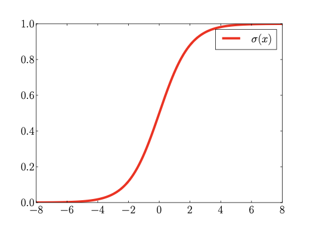

### Binary logistic regression

The binary logistic regression is a discriminative probabilistic model with linear decision boundaries. 
Suppose we are given a **labeled dataset**

$$
\{(x_i, c_i)\}_{i=1}^N,
$$

where each feature vector $x_i \in \mathbb{R}^d$ represents a sample and each class label $c_i \in \{0,1\}$ indicates membership to class 1 or class 0. Assuming that feature vectors and corresponding class labels are i.i.d.. 

For binary case Logistic Regression aims at modeling the class posterior probabilities.
$$
P(C=1|x), \ P(C=0|x)=1-P(C=1|x)
$$

**Classification rule**:
- The model assumes that the separation surface between the classes
is a linear surface (hyperplane), corresponding to linear decision
functions of the form:
  $$
  s(x; w, b)=w^tx+b  \lessgtr t
  $$
- $(w,b)$ are the model parameters and represent the separation
surface.
- Classification rule: assign class 1 if $s(x)> t$, class 0 otherwise.
- With equal priors and symmetric costs, the optimal threshold is $t=0$.
- Decision boundaries are linear hyperplanes orthogonal to $w$.

**Probabilistic interpretation** 
* The score $s(x)$ corresponds to the **log-posterior ratio**:

  $$
  s(x) = \log \frac{P(C=1|x)}{P(C=0|x)}.
  $$
- So, posterior probabilities for the classes are computed as: 
  $$
  P(C=1|x; w, b) = \sigma(s(x; w,b)) = \frac{1}{1 + e^{-s(x)}}, 
  $$
  $$
  P(C=0|x; w,b) = 1 - \sigma(s(x;w,b)).
  $$
- Where $\sigma$ denotes the sigmoid function:
 
* Interpretation: smooth probabilistic mapping from linear function of x.

---

#### **Parameter estimation & training objective**

* Each label $c_i \in \{0,1\}$ is modeled as a **Bernoulli random variable** with parameter $\sigma(s(x_i))$:

  $$
  P(C=c_i|x_i,w,b) = \sigma(s_i)^{c_i}(1-\sigma(s_i))^{1-c_i}.
  $$
* Likelihood (i.i.d. samples):

  $$
  L(w,b) = \prod_{i=1}^N P(C=c_i|x_i,w,b).
  $$
* Log-likelihood:

  $$
  \ell(w,b) = \sum_{i=1}^N \big[c_i\log\sigma(s_i) + (1-c_i)\log(1-\sigma(s_i))\big].
  $$
* Training = **maximize log-likelihood** or equivalently **minimize cross-entropy**:

  $$
  J(w,b) = -\ell(w,b).
  $$
* Alternative view: **risk minimization** with logistic loss

  $$
  \ell(z,s) = \log(1+e^{-z s}), \quad z \in \{-1,+1\}.
  $$
* Optimization is numerical (no closed form). Regularization (e.g. $\tfrac{\lambda}{2}\|w\|^2$) controls complexity and avoids overfitting .

* **Regularization**
  When classes are linearly separable, the logistic regression solution is not defined because objective function approaches zero only as the norm of $w$ grows to infinity. To make problems solvable and avoid overfitting, we introduce a regularization term penalty into the averaged objective function ($ \lambda > 0$):
  $$
  R(w,b) = \frac{\lambda}{2}||w||^2 + \frac{1}{n} \sum_{i=1}^n \log(1+e^{-z_i(w^Tx_i+b)})
  $$
  if $\lambda$ is too large, the model underfits the training data. On the other hand, if it's too small, it overfits it.
  
---

#### **Non-linear classification extension**

* Replace input features $x$ with a **non-linear mapping** $\phi(x)$.
* Model becomes:

  $$
  s(x) = w^T \phi(x) + c.
  $$
* The decision boundary is linear in $\phi(x)$ but possibly non-linear in original space.
* Example: polynomial feature expansion, kernelized logistic regression.

---

#### **Extension to score calibration**

* Logistic regression scores already approximate **log-likelihood ratios (LLRs)**, but can be **biased or miscalibrated** if regularization or prior mismatch occurs.
* **Calibration approaches**:

  * **Prior-weighted logistic regression**: train with effective prior $\tilde{\pi}$ reflecting application needs.
  * **Affine calibration**: post-process raw scores with

    $$
    s_{cal}(x) = \alpha s(x) + \beta,
    $$

    where $\alpha,\beta$ are fitted on a calibration set via logistic regression.
* This provides **well-calibrated LLRs** usable across applications with different priors and costs.
